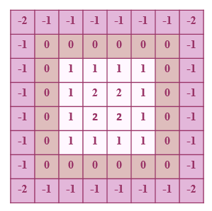
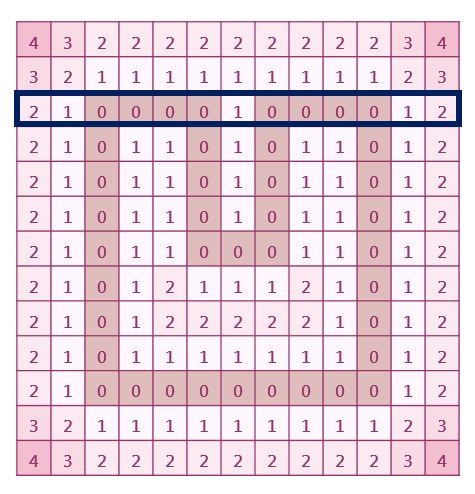

# dist_model
###### 先把model做voxelizer，再計算距離場 ######
### 目的
把模型外部空氣的部分都設成負號。
- 距離場是由空間中任意點到模型的最短距離所組成的場，無法分辨內外體素，所以要手動把外部體素找出來並標記成負號
- 表面體素為0，由表面往外擴張n個距離單位為n

_輸入_


_輸出_



### 想法
> 觀察上圖模型，大家一定能想到一種簡單的判斷方法
> 一條ray穿過模型，判斷有幾段"0"，
> 如果基數段，代表經過的點都在模型外部
> 如果偶數段，代表第一段到第二段中間是模型內部
> 結果是不行的
> 

我的想法是

1. 考慮大小為 NxM 的模型。
2. 沿著 +x 軸方向發射一條射線，從 y = 0 開始掃描至 y = M-1。
3. 在掃描過程中，將射線經過的模型區域標記為外部點，設為負號，直到射線經過模型表面（距離值為 0 的體素）。
4. 一旦射線經過模型表面，檢查每個體素的"被掃描過的鄰居體素"。
5. 如果鄰居體素在模型外部，將該體素設為負號。
6. 如果鄰居體素在模型內部，保持該體素正號不變。
7. 沿著 -x  軸方向發射一條射線，從 y = M-1開始掃描至 y = 0。
8. 重複步驟3~7
9. 結束

例子:深藍色框圈起的數字代表射線所經過的體素，淺藍色框圈起的體素代表該體素的"被掃描過的鄰居體素"。根據上述方法，深藍色框圈起的數字應該被改成負號。
> 

sudo code
```sh
for(y = 0~M)
	for(x = 0~N)
		if(射線經過模型表面){
			if((data[y-1][x] 或 data[y][x-1] 在模型外部 ) 且 data[y][x]不是表面體素) 把data[y][x]設為模型外部
		}	
		else 把data[y][x]設為模型外部
```

