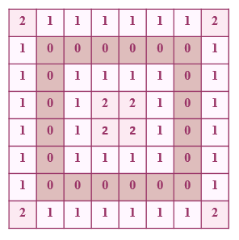

# dist_model
###### 先把model做voxelizer，再計算距離場 ######
### 目的
把模型外部空氣的部分都設成負號。
- 距離場是由空間中任意點到模型的最短距離所組成的場，無法分辨內外體素，所以要手動把外部體素找出來並標記成負號
- 表面體素為0，由表面往外擴張n個距離單位為n
_輸入_

_輸出_


### 想法
> 觀察上圖模型，大家一定能想到一種簡單的判斷方法
> 一條ray穿過模型，判斷有幾段"0"，
> 如果基數段，代表經過的點都在模型外部
> 如果偶數段，代表第一段到第二段中間是模型內部
> 結果是不行的
> 

> 我的想法是一樣用scan line的方法來操作
> 假設模型是NxM
> 沿著+x軸方向發射一條ray，從y = 0開始到y= M-1
> ray會把經過的外部點都設成負號，內部點及表面不變
> Q 如何判斷是不是內部點?
> A 當ray經過表面體素之後的點，都有可能成為內部
> 所以要看"被掃描過的鄰居體素"有沒有在模型外部的，如果有此點就在模型外部
> 如下圖深藍色框框為目前體素，淺藍色框框為"被掃過得鄰居體素"，由上述的想法，深藍色框框的體素應要設成負號
> 

sudo code
```sh
for(y = 0~M)
	for(x = 0~N)
		if(已遇到過表面體素){
			if((data[y-1][x] 或 data[y][x-1] 在模型外部 ) 且 data[y][x]不是表面體素) 把data[y][x]設為模型外部
		}	
		else 把data[y][x]設為模型外部
```

